# Monoset

[](https://npmjs.com/package/@monoset/react)
[](./LICENSE)

A minimal, monotone, brand-neutral design system. Tokens and React components for teams that want their product to look like their product, not like the design system.

**Live docs:** [monoset.design](https://monoset.design)

**Scaffold a new project:** `npm create monoset-app@latest`

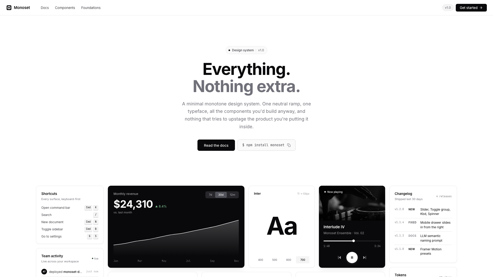

## Why

Most design systems arrive with a visual personality already baked in. Rounded corners everywhere, pastel accents, an illustration style. The other common shape is a sprawl of six hundred tokens across a dozen brand themes that nobody fully configures.

Monoset is a third path. The whole palette is one 12-step neutral ramp. Every surface, every border, every piece of text reads from that scale, so the system has one dial (tone) instead of twelve. The shapes are conservative: 4px grid, hairline borders, shadows reserved for surfaces that are actually floating. Motion has three durations and one easing curve, and it always gets out of the way once it's told you what happened.

Interactive behavior comes from Radix, React Aria, and a small set of Monoset implementations. Menus and dialogs use Radix. Complex fields such as Calendar, DatePicker, Combobox, and NumberInput use React Aria.

If you want a system that stays quiet so your product can be the loud thing, that's the pitch.

## Packages

This repo is a monorepo with framework packages, tooling, and the documentation site.

| Package | What it is |
|---|---|
| [`@monoset/tokens`](./packages/tokens) | CSS custom properties and JSON tokens. Drop-in for any framework. |
| [`@monoset/motion`](./packages/motion) | Framer Motion presets: easings, durations, reusable variants. |
| [`@monoset/react`](./packages/react) | React component library with a full stylesheet and selective component entries. |
| [`website/`](./website) | Vite + React docs site. What you see at the live URL. |

## Install

### Just the tokens

If you don't need React, pull in the CSS variables and style your own components against them.

```bash
npm install @monoset/tokens
```

```css
@import "@monoset/tokens/css";

.card {
  background: var(--bg);
  color: var(--fg1);
  border: 1px solid var(--border-subtle);
  border-radius: var(--radius-md);
  padding: var(--space-4);
  font-family: var(--font-sans);
}
```

### The React kit

```bash
npm install @monoset/react @monoset/tokens react react-dom
```

```jsx
import "@monoset/tokens/css";
import "@monoset/react/styles.css";
import { MonosetProvider, Button, Field, Input } from "@monoset/react";

export default function App() {
  return (
    <MonosetProvider>
      <Field label="Email" description="We'll send a confirmation.">
        <Input type="email" placeholder="you@example.com" />
      </Field>
      <Button variant="primary">Continue</Button>
    </MonosetProvider>
  );
}
```

`@monoset/react` supports React 18 and 19. See the [React package guide](./packages/react) for its component index, selective CSS entry points, form patterns, and migration notes.

The React v1 release gate runs 466 automated tests and 9 browser gates. The packed package is checked as ESM, CommonJS, and TypeScript, including server rendering. A Button-only production import measures about 1.07 KB gzip.

## What's in the component library

<table>
  <tr>
    <td width="50%">
      <strong><a href="https://monoset.design/buttons">Button</a></strong><br/>
      Four variants, three sizes.<br/>
      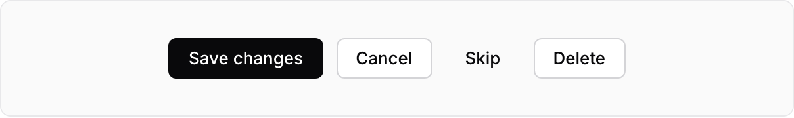
    </td>
    <td width="50%">
      <strong><a href="https://monoset.design/inputs">Input &amp; Field</a></strong><br/>
      Label + helper + error, wired up.<br/>
      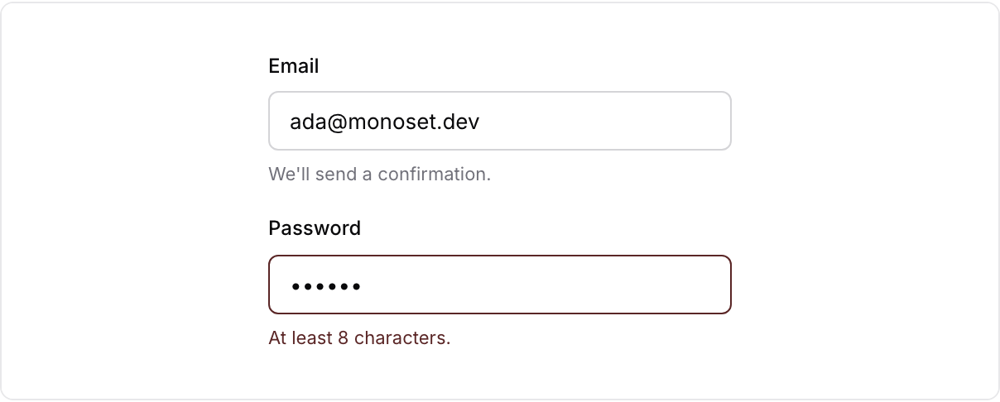
    </td>
  </tr>
  <tr>
    <td>
      <strong><a href="https://monoset.design/badges">Badge</a></strong><br/>
      Status, counts, category tags.<br/>
      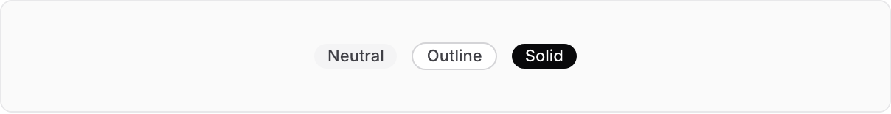
    </td>
    <td>
      <strong><a href="https://monoset.design/cards">Card</a></strong><br/>
      Outline, elevated, inset.<br/>
      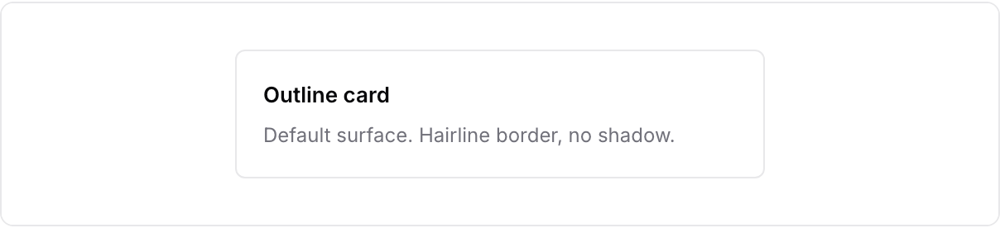
    </td>
  </tr>
  <tr>
    <td>
      <strong><a href="https://monoset.design/toggles">Checkbox &amp; Switch</a></strong><br/>
      Same look, different semantics.<br/>
      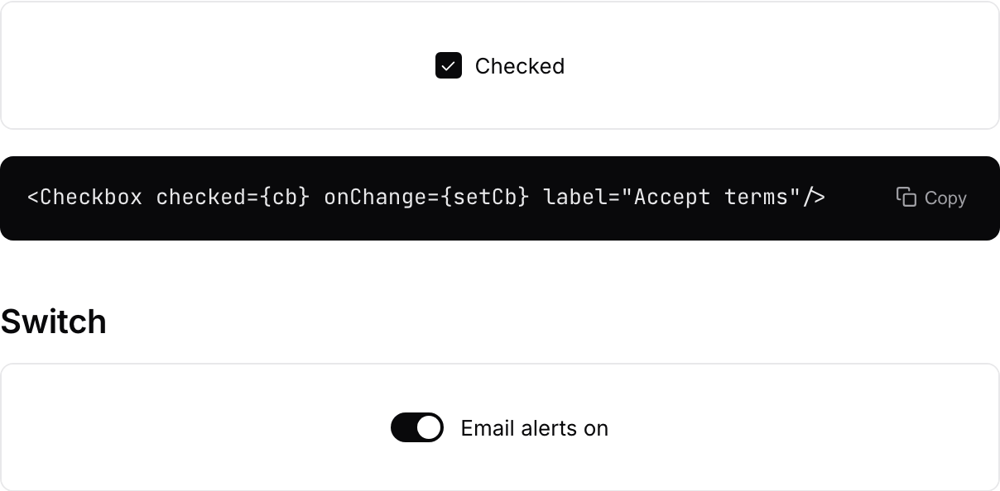
    </td>
    <td>
      <strong><a href="https://monoset.design/tabs">Tabs</a></strong><br/>
      Underline tabs for related panels.<br/>
      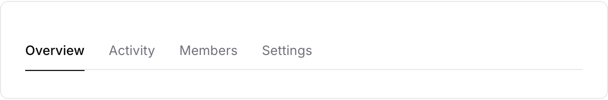
    </td>
  </tr>
  <tr>
    <td>
      <strong><a href="https://monoset.design/alerts">Alert &amp; Toast</a></strong><br/>
      Inline and transient feedback.<br/>
      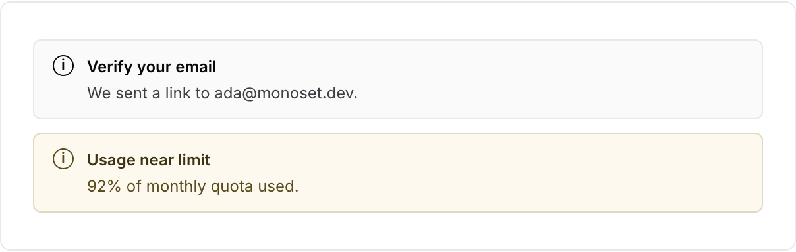
    </td>
    <td>
      <strong><a href="https://monoset.design/avatars">Avatar</a></strong><br/>
      Initials, sizes, stacking.<br/>
      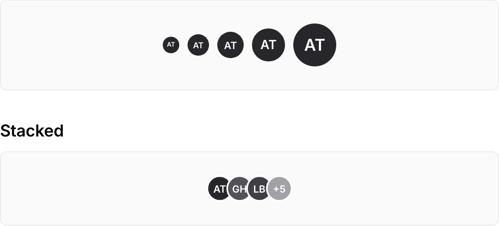
    </td>
  </tr>
  <tr>
    <td>
      <strong><a href="https://monoset.design/accordion">Accordion</a></strong><br/>
      Disclosure panels, Radix-backed.<br/>
      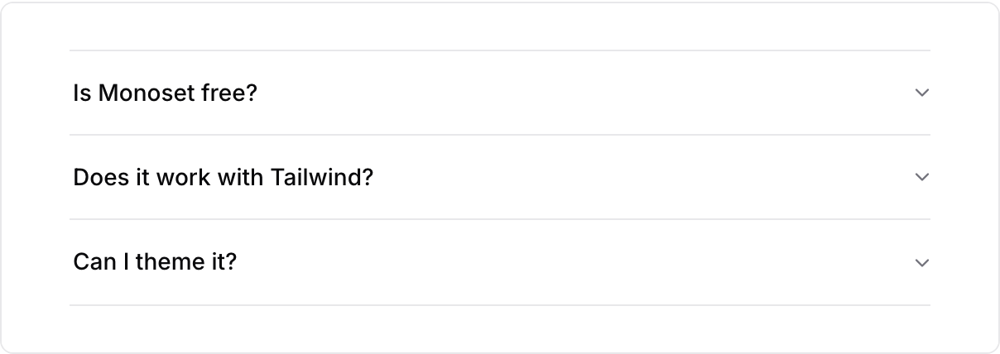
    </td>
    <td>
      <strong><a href="https://monoset.design/slider">Slider</a></strong><br/>
      A range input with a readout.<br/>
      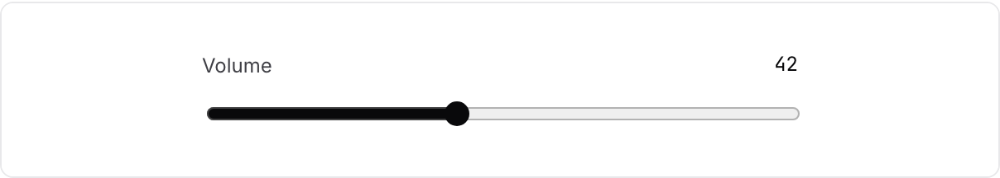
    </td>
  </tr>
  <tr>
    <td>
      <strong><a href="https://monoset.design/toggle">Toggle group</a></strong><br/>
      A segmented control.<br/>
      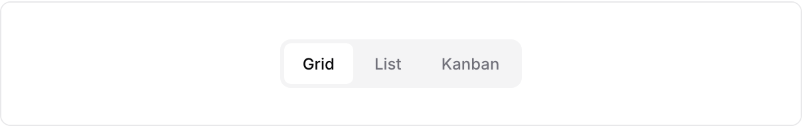
    </td>
    <td>
      <strong><a href="https://monoset.design/kbd">Kbd</a></strong><br/>
      Keyboard-shortcut chips.<br/>
      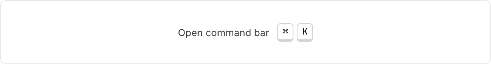
    </td>
  </tr>
  <tr>
    <td>
      <strong><a href="https://monoset.design/spinner">Spinner</a></strong><br/>
      Waits longer than 400ms.<br/>
      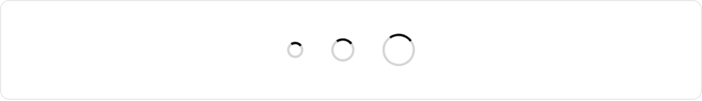
    </td>
    <td>
      <strong><a href="https://monoset.design/table">Table</a></strong><br/>
      Dense rows, hairline separators.<br/>
      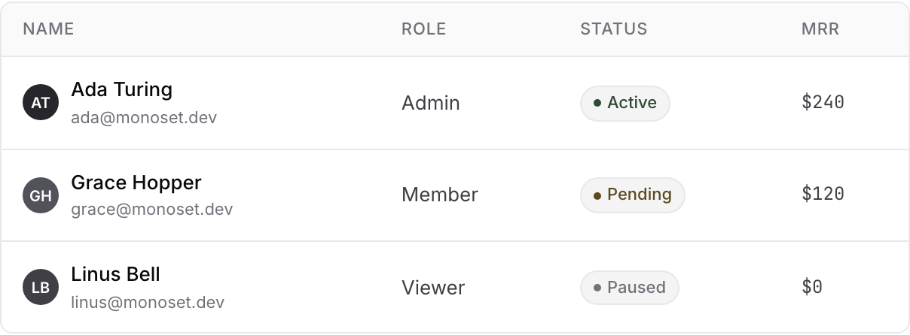
    </td>
  </tr>
</table>

Also included: Textarea, RadioGroup, Select, Combobox, MultiCombobox, Calendar, DatePicker, NumberInput, PinInput, PasswordInput, FileUpload, Toggle, Dialog, Sheet, Popover, Tooltip, HoverCard, DropdownMenu, ContextMenu, CommandPalette, NavigationMenu, Breadcrumb, Pagination, Stepper, Carousel, EmptyState, Skeleton, Separator, Progress, and layout primitives.

Use `@monoset/react/styles.css` for the full stylesheet, or import selective component entries. There is no CSS-in-JS runtime. The only provider you need is `<MonosetProvider>`, which sets up the toast queue and the shared tooltip root.

Motion helpers have their own entry:

```jsx
import { Reveal, fadeUp } from "@monoset/react/motion";
```

## Design principles

**Monotone.** If a component feels like it needs color, something else is off. Lean on tone and weight first, and reach for iconography before you reach for a hue.

**Hairlines beat shadows.** A 1px border carries almost the whole system. Shadows are reserved for surfaces that are actually floating above something, like a modal scrim or a popover.

**4px grid.** Everything snaps. The temptation to sneak in a 7px margin because it "looks right" is where systems start to decay.

**Motion confirms, then gets out of the way.** Three durations (120/180/280ms), one easing curve. Nothing springs, nothing bounces, nothing hangs around for 900ms pretending to be cinematic.

**Don't reinvent.** Use native controls when they fit. Use Radix or React Aria when focus, collections, or keyboard behavior get more involved.

## Local development

```bash
git clone https://github.com/antonijap/monoset-design-system
cd monoset-design-system
pnpm install

# Run the docs site (Vite)
pnpm dev

# Build the library packages
pnpm --filter @monoset/motion build
pnpm --filter @monoset/react build
```

Requires Node 20+ and pnpm.

## Contributing

Issues and PRs are welcome. A few things worth knowing before you open one:

**Don't add color.** Suggestions that introduce brand hues, accent colors, or traffic-light status colors will be closed. The monotone constraint is load-bearing.

**Don't add a component you won't use.** The bar is "I needed this, couldn't find it, would reuse it on three other projects", not "most libraries have one". A smaller kit that teams actually reach for beats a big kit where half the components rot.

**Match what's there.** One file per component, classes prefixed `.ms-`, TypeScript types exported from the package root. If you're adding styles, keep the same CSS-file structure used elsewhere in `@monoset/react/src/styles.css`.

For anything bigger than a tweak, open an issue first.

## License

[MIT](./LICENSE) © Antonija Pek

## Credits

Built with [Radix UI](https://radix-ui.com), [React Aria](https://react-spectrum.adobe.com/react-aria/), and [Framer Motion](https://motion.dev). The token restraint takes cues from [Radix Colors](https://www.radix-ui.com/colors), while the plain CSS distribution borrows a useful idea from [shadcn/ui](https://ui.shadcn.com).
